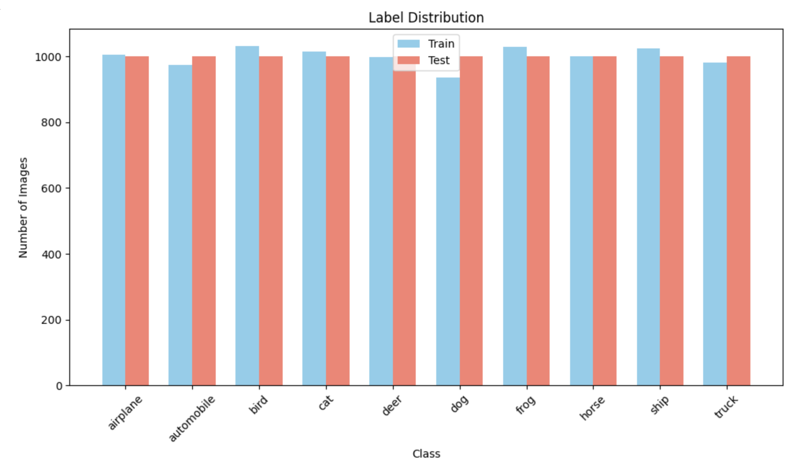
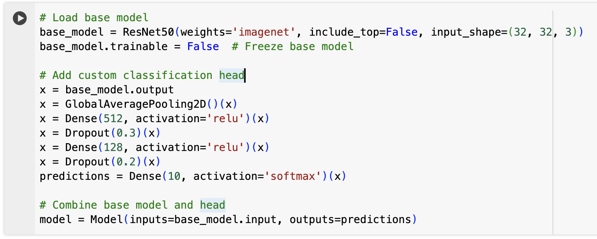
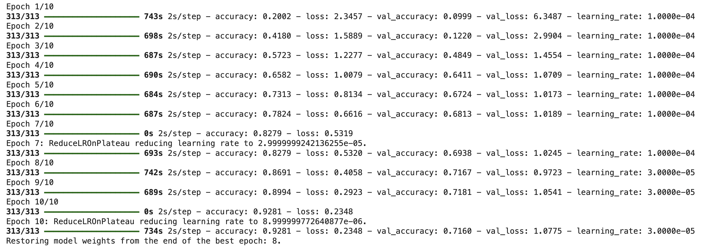
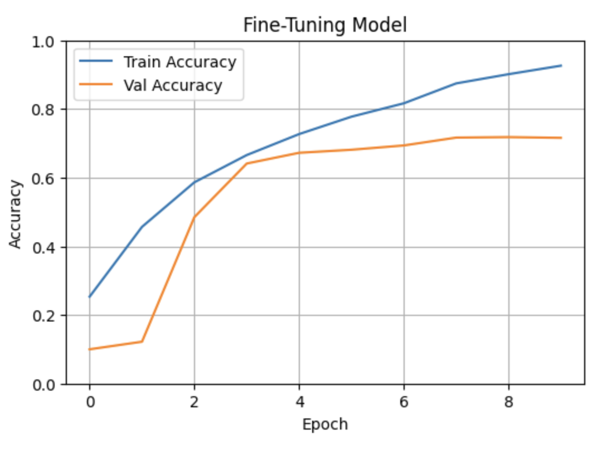

# 🧠 Computer Vision with CIFAR-10

This project demonstrates a full deep learning workflow for image classification using the CIFAR-10 dataset. The main objective is to build, train, fine-tune, and evaluate a convolutional neural network using **Transfer Learning** with **ResNet50** (and optionally EfficientNet).

## 🎯 Project Overview

- Dataset: [CIFAR-10](https://www.cs.toronto.edu/~kriz/cifar.html)
- Framework: TensorFlow / Keras
- Approach: Transfer Learning with custom classification head
- Focus: Model training, fine-tuning, and evaluation



---

## 📂 Project Structure

- `Project_Computer_Vision.ipynb` – Jupyter Notebook with the entire workflow
- `project_computer_vision.py` – Script version of the notebook
- `Project_CV_presentation.pdf` – Final project presentation (3–5 min pitch)

```
computer-vision-cifar10/
│
├── notebooks/
│   └── Project_Computer_Vision.ipynb          # Notebook
│
├── scripts/
│   └── project_computer_vision.py             # Python script
│
├── presentation/
│   └── Project_CV_presentation.pdf            # Short presentation (3-5 minutes)
│
├── screenshots/
│   ├── accuracy_plot.png                      # Plot
│   ├── confusion_matrix.png                   # Confusion Matrix
│   └── sample_predictions.png                 # Samples for wrong classififcation
│
├── README.md                                  # Project description
├── requirements.txt                           # Requirements
```

---

## 🏗️ Model Architecture

- **Base model:** ResNet50 (ImageNet weights, no top)
- **Custom head:**
  - GlobalAveragePooling2D
  - Dense(512) + Dropout
  - Dense(128) + Dropout
  - Softmax (10 classes)
- **Alternative (optional):** EfficientNetB0



---

## 🏋️‍♂️ Training Strategy

1. **Train the custom head** with frozen base model
2. **Unfreeze base model** and fine-tune entire network
3. Use callbacks:
   - `ReduceLROnPlateau`
   - `EarlyStopping`
4. (Optional) `ImageDataGenerator` for augmentation



---

## 📊 Evaluation

- Final validation accuracy: ~72%
- Confusion matrix analysis
- Visualized wrong predictions 

### Plots:



---

## 📝 Final Conclusion

- Learned how to use pretrained CNNs for image classification
- Implemented and evaluated training strategies
- Future steps:
  - Try EfficientNet or other architectures
  - Tune hyperparameters
  - Add more data/augmentation

---

## 🔗 Contact

📧 [sebastian.bangemann@web.de](mailto:sebastian.bangemann@web.de)  
🔗 [LinkedIn Profile](https://www.linkedin.com/in/sebastian-bangemann)

---

## 📸 Screenshots (in `/screenshots/`)

- `accuracy.png`: Training & validation accuracy
- `conf_matrix.png`: Final evaluation
- `custom_head`: Build a custom head
- `false_predictions`: Sample of wrong predictions
- `label_distribution`: Label distribution in CIFAR10
- `training_progress`: How went the training?